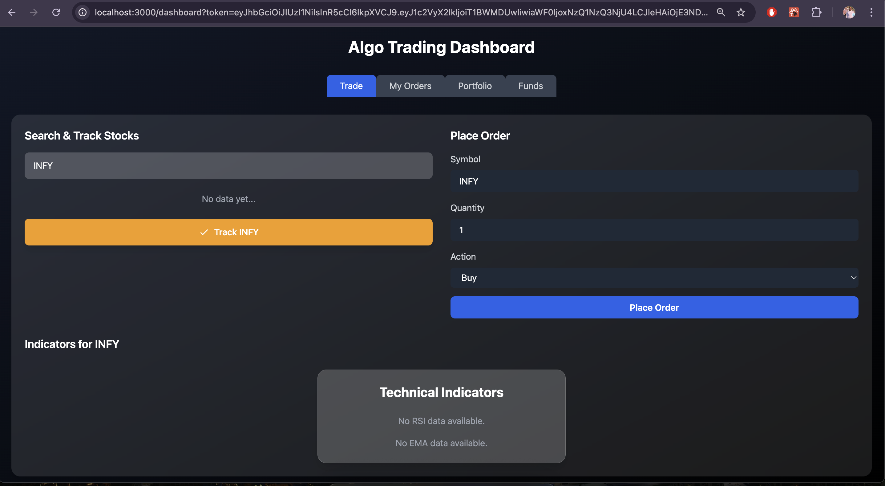
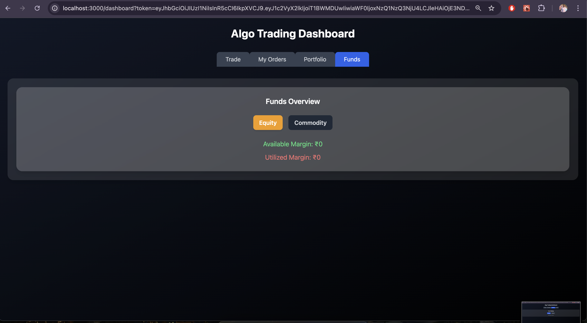
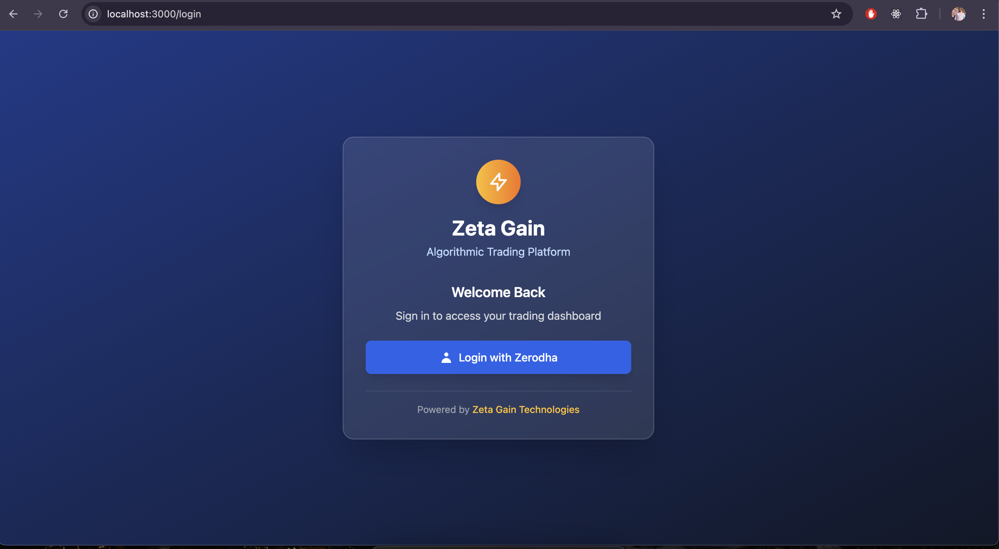
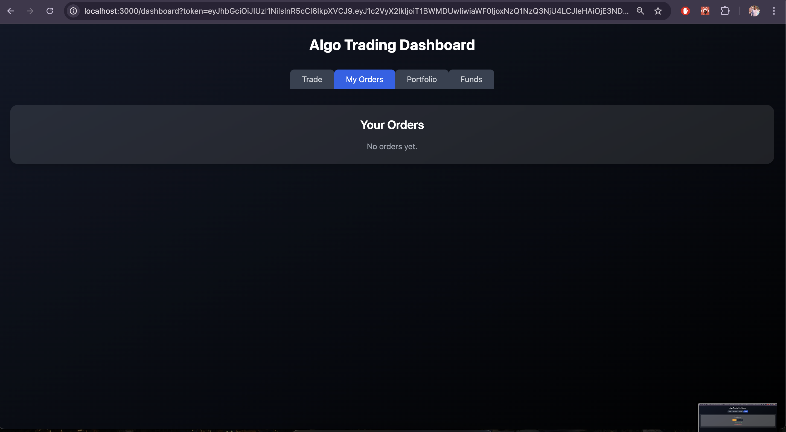
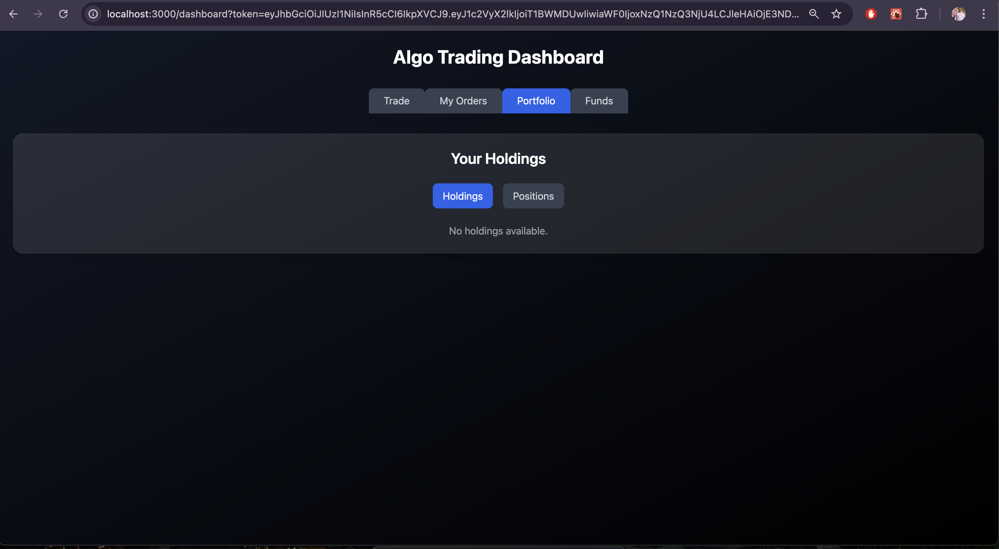

# Algo Trading Bot with Kite Connect

## Setup

1. **Clone the repo**

   ```bash
   git clone https://github.com/your-repo/algo-trading-bot.git
   cd algo-trading-bot
   ```

2. **BACKEND setup**

   ```bash
   cd server
   npm install
   cp .env.example .env
   # Add KITE_API_KEY in .env
   node app.js
   ```

3. **FRONTEND setup**

   ```bash
   cd client
   npm install
   npm start
   ```
## Screenshots

   1. **Dashboard**
   

   2. **Funds**
   

   3. **Login**
   

   4. **Orders**
   

   4. **Portfolio**
   