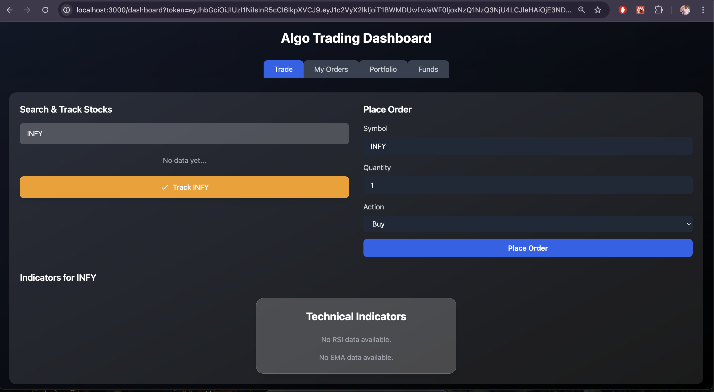
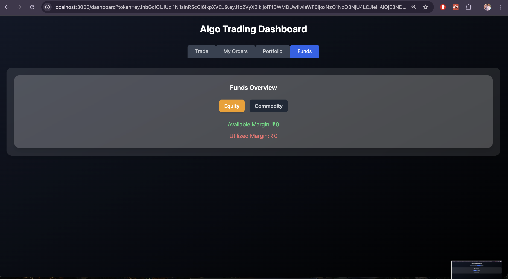
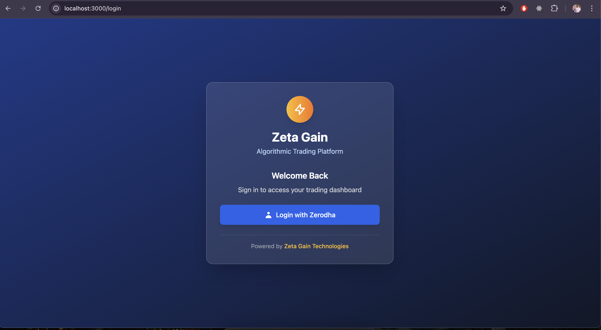
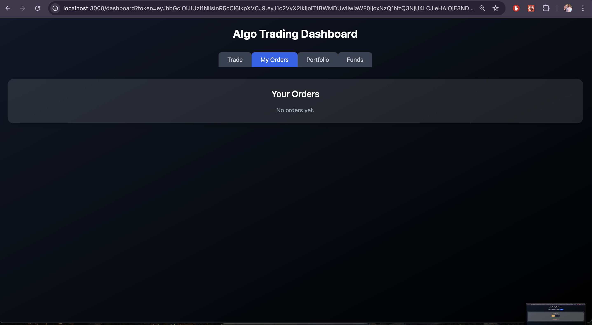
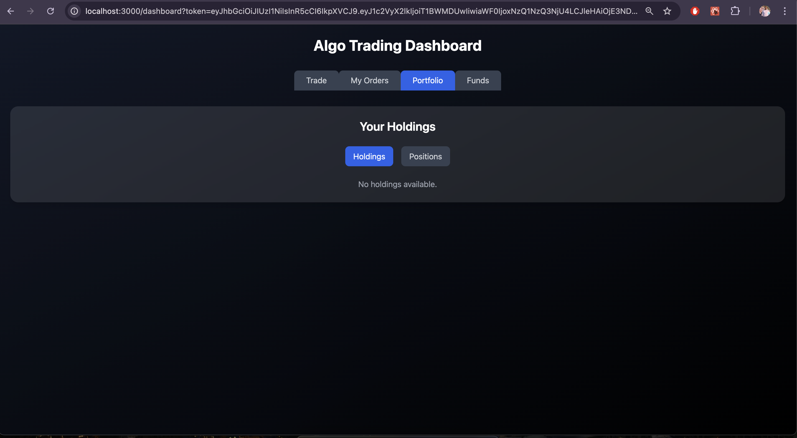

# Zeta Gain — Zerodha Personal Trading Terminal

This repository is now a single Next.js full-stack application. The interface and authenticated Kite Connect API routes are served from one origin locally and on Vercel.

## Current functionality

- Zerodha Kite Connect login and logout with a signed, HTTP-only session cookie.
- Live NSE quote lookup for a user-entered equity symbol.
- Liquidity-grab analysis using three daily candles and previous-day RSI(14).
- Account views for orders, holdings, positions, and available equity funds.
- A reusable filter builder with create, rename, edit, and delete operations. Filters are saved in the browser.
- Technical conditions using Open, High, Low, Close, Volume, RSI, SMA, and EMA.
- Latest, one-day-ago, and two-days-ago candle references on either side of a comparison.
- Numeric and indicator-to-indicator comparisons using greater than, less than, equal, not equal, crosses above, and crosses below operators.
- A one-click three-candle preset for previous Open > Close conditions and latest Open < Close.
- NIFTY 50 scanning with matching symbols and their latest closing prices.
- Supabase Postgres persistence for filters, scan history, watchlists, alerts, and an independent order audit log.
- Configurable NIFTY 50/100/200/500, all-NSE-equity, and watchlist universes with a daily cached Kite instrument master.
- Daily, weekly, 15-minute, and hourly historical scans with AND/OR condition logic, retry/backoff, and preset strategies.
- Interactive candlestick and volume charts powered by TradingView Lightweight Charts, with SMA/EMA overlays and a horizontal drawing line.
- Confirmed manual place/modify/cancel order actions; scan matches are never auto-executed.

Historical-data analysis and NIFTY 50 scans require a Kite Connect subscription that permits historical candle requests. The application currently detects setups and displays account information; it does not automatically place trades.

## Liquidity-grab strategy

The strategy endpoint evaluates the latest three daily candles for a selected NSE equity:

1. The two previous candles must be red (`close < open`).
2. The present-day candle must be green (`close > open`).
3. RSI(14), calculated at the previous day's close, must be below 50.

The present-day candle changes while the market is open, so an intraday match is provisional until the daily candle closes. This implementation detects and displays the setup; it does not automatically place an order.

## Setup

1. **Clone the repo**

   ```bash
   git clone https://github.com/your-repo/algo-trading-bot.git
   cd algo-trading-bot
   ```

2. Install and configure the application

   ```bash
   npm install
   cp .env.example .env.local
   # Add KITE_API_KEY, KITE_API_SECRET, JWT_SECRET, DATABASE_URL, and CRON_SECRET
   npm run dev
   ```

3. Configure the Kite Connect redirect URL

   ```bash
   http://localhost:3000/api/auth/callback
   ```

For Vercel, set the same three secrets as project environment variables and configure the production callback as `https://YOUR-DOMAIN/api/auth/callback` in the Kite developer console.

## Database setup

Create a Supabase project and run [`supabase/migrations/202607170001_hybrid_terminal.sql`](./supabase/migrations/202607170001_hybrid_terminal.sql) in its SQL editor. Add the pooled Postgres connection string as `DATABASE_URL`. The application uses a private `zeta_gain` schema through server-only queries; Supabase browser keys are neither needed nor exposed.

Existing browser filters are imported once after login. Local storage remains an offline cache, while Postgres becomes the source of truth when configured.

For index universes beyond the built-in NIFTY 50 list, configure comma-separated `NIFTY_100_SYMBOLS`, `NIFTY_200_SYMBOLS`, and `NIFTY_500_SYMBOLS`. `ALL_NSE_EQUITY` is derived from Kite's instrument master and cached for 24 hours.

Vercel Cron calls `/api/cron/scans` once daily at 09:20 IST using `CRON_SECRET`, which is compatible with Vercel Hobby limits. Because Kite access tokens are intentionally not stored in the database and expire daily, unattended historical scans require a renewable secondary market-data provider. Until one is configured, scheduled runs are recorded as failed with an explicit explanation rather than weakening credential security.

## Safety and data permissions

- Historical scans and charts require the paid Kite historical-data permission.
- Placing, modifying, or cancelling an order requires a human confirmation. No scan automatically trades.
- `orders_log` is a local audit trail; Kite remains the order-book source of truth.
- Intraday charts use on-demand historical candles; real-time WebSocket streaming is a future enhancement.
## Screenshots

   1. **Dashboard**
   

   2. **Funds**
   

   3. **Login**
   

   4. **Orders**
   

   4. **Portfolio**
   
